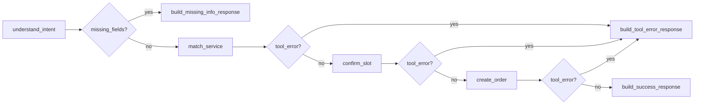

# 本地生活服务 Agent 系统

面向本地生活服务预约场景的多 Agent 智能预约平台。系统参考 Harness Engineering 与多 Agent 协同架构，将自然语言预约任务拆分为意图理解、信息补全、服务匹配、时间确认、订单生成、执行校验等可编排节点，并通过长期记忆、工具权限控制和 Skills 复用机制提升连续对话能力、执行安全性与业务闭环能力。

## 技术栈

- Python 3.11+
- FastAPI
- 原生 HTML / CSS / JavaScript
- LangGraph
- PostgreSQL
- Alembic
- Redis
- Docker / Docker Compose
- Skills / Harness Engineering 思路

## 核心能力

- 多 Agent 协同：基于 LangGraph 将复杂预约流程拆分为可观测、可恢复、可扩展的节点。
- 长期记忆：沉淀用户偏好、历史需求、任务状态与项目经验，支持连续预约场景。
- 工具权限控制：对外部工具调用做权限校验、任务隔离、审计记录和边界控制。
- 预约闭环：覆盖需求理解、服务匹配、时间确认、订单创建与状态追踪。
- Skills 沉淀：将 Learn -> Patch -> Validate 过程中的经验、审查规则和测试策略转化为可复用能力。
- 容器化部署：通过 Docker Compose 提供 API、PostgreSQL、Redis 等本地开发环境。

## 项目结构

```text
.
├── app/
│   ├── api/                  # FastAPI 路由层
│   ├── agents/               # Simple/ReAct/Booking 等 Agent 实现
│   ├── core/                 # Agent基类、LLM、消息、配置、异常
│   ├── db/                   # 数据库连接与迁移入口
│   ├── frontend/             # FastAPI 托管的前端工作台
│   ├── integrations/         # 外部本地生活服务接口适配
│   ├── memory/               # 用户长期记忆与会话状态
│   ├── models/               # 领域模型与数据结构
│   ├── services/             # 预约业务服务
│   ├── skills/               # 可复用经验、规则、流程
│   └── tools/                # 工具基类、注册、权限与沙箱
├── tests/                    # 测试用例
├── migrations/               # Alembic 数据库迁移
├── docker-compose.yml        # 本地依赖编排
├── Dockerfile                # API 服务镜像
├── pyproject.toml            # Python 项目配置
└── .env.example              # 环境变量模板
```

## 快速开始

### 1. 环境准备

确保已安装 Python 3.11+ 和 Docker Desktop。

### 2. 创建虚拟环境并安装依赖

```bash
# Windows PowerShell
python -m venv venv
.\venv\Scripts\Activate.ps1
pip install -e ".[dev]"
```

```bash
# macOS / Linux
python3 -m venv venv
source venv/bin/activate
pip install -e ".[dev]"
```

### 3. 复制环境变量

```bash
copy .env.example .env
```

根据需要编辑 `.env` 文件，填入 API Key 等配置（如 `AMAP_API_KEY`、`LLM_API_KEY`）。

### 4. 启动本地依赖（PostgreSQL、Redis）

```bash
docker compose up -d postgres redis
```

### 5. 执行数据库迁移

```bash
# 确保虚拟环境已激活
alembic upgrade head
```

### 6. 启动 API 服务

```bash
# 方式一：通过 python -m 启动（推荐，无需激活虚拟环境）
python -m uvicorn app.main:app --reload

# 方式二：激活虚拟环境后直接运行
# .\venv\Scripts\Activate.ps1    # Windows
# source venv/bin/activate        # macOS/Linux
# uvicorn app.main:app --reload
```

### 7. 访问接口文档

```text
http://127.0.0.1:8000/docs
```

### 8. 访问前端工作台

```text
http://127.0.0.1:8000/
```

## 前端工作台

当前前端位于 [app/frontend](D:/ZERO/Auser/本地生活agent/app/frontend)，由 FastAPI 直接托管，不需要额外的 Node.js 构建流程。

文件说明：

- [app/frontend/index.html](D:/ZERO/Auser/本地生活agent/app/frontend/index.html)：工作台页面结构。
- [app/frontend/styles.css](D:/ZERO/Auser/本地生活agent/app/frontend/styles.css)：响应式布局与组件样式。
- [app/frontend/app.js](D:/ZERO/Auser/本地生活agent/app/frontend/app.js)：表单状态、API 请求、结果渲染。
- [app/main.py](D:/ZERO/Auser/本地生活agent/app/main.py)：挂载 `/` 页面和 `/assets` 静态资源。

当前界面能力：

- 提交自然语言预约请求。
- 填写地点、时间偏好和会话 ID。
- 勾选或取消工具权限，验证权限拒绝路径。
- 展示 Agent 状态、缺失字段、候选服务商和原始响应 JSON。
- 展示候选服务商价格、履约时长和库存锁状态。
- 权限不足时显示权限缺失提示。
- 一键填充缺失信息样例，方便测试 `needs_info` 路径。

前端调用的后端接口：

```http
POST /api/v1/bookings
Content-Type: application/json
```

请求结构：

```json
{
  "user_id": "user_001",
  "session_id": null,
  "message": "帮我预约保洁",
  "context": {
    "location": "深圳南山",
    "time_preference": "明天下午",
    "permissions": [
      "booking:match",
      "booking:slot",
      "booking:order",
      "external_api:local_life",
      "privacy:user_context",
      "order:write"
    ]
  }
}
```

开发约定：

- 业务字段尽量从 `BookingRequest` 和 `BookingResponse` 模型推导，避免前后端字段名漂移。
- 新增 Agent 状态展示时，优先扩展后端响应模型，再更新 `app.js` 的渲染逻辑。
- 前端暂时保持零构建依赖；如果后续引入 React/Vue，需要同步更新启动、构建和部署说明。

## 本地生活服务接口

预约工具已经改为通过 [app/integrations/local_life_client.py](D:/ZERO/Auser/本地生活agent/app/integrations/local_life_client.py) 调用真实本地生活服务接口，不再在工具中写死服务商、时间和订单数据。

环境变量：

```bash
LOCAL_LIFE_API_BASE_URL=https://your-local-life-service.example.com
LOCAL_LIFE_API_KEY=your_service_api_key
LOCAL_LIFE_SANDBOX_BASE_URL=https://sandbox-local-life.example.com
LOCAL_LIFE_SANDBOX_API_KEY=your_sandbox_key
LOCAL_LIFE_TIMEOUT=15
LOCAL_LIFE_DRY_RUN=false
```

开发环境可以保持：

```bash
LOCAL_LIFE_DRY_RUN=true
```

此时不会请求外部接口，会返回可预测的开发数据，便于本地跑测试和开发 LangGraph 流程。

### 接口契约

服务匹配：

```http
POST /services/match
Authorization: Bearer <LOCAL_LIFE_API_KEY>
Content-Type: application/json
```

请求：

```json
{
  "service_category": "home_cleaning",
  "location": "深圳南山"
}
```

期望响应：

```json
{
  "candidates": [
    {
      "provider_id": "provider_001",
      "name": "安心到家保洁",
      "category": "home_cleaning",
      "location": "深圳南山",
      "score": 0.92,
      "price": {
        "amount": 199,
        "currency": "CNY",
        "unit": "次",
        "display_text": "¥199/次"
      },
      "service_area": {
        "city": "深圳",
        "district": "南山",
        "radius_km": 8
      },
      "fulfillment": {
        "duration_minutes": 150,
        "service_mode": "on_site",
        "earliest_start_time": "2026-06-09T15:00:00+08:00"
      },
      "inventory_lock": {
        "lock_id": "lock_001",
        "locked": true,
        "expires_at": "2026-06-08T14:00:00+08:00",
        "status": "locked"
      }
    }
  ]
}
```

时间确认：

```http
POST /availability/confirm
Authorization: Bearer <LOCAL_LIFE_API_KEY>
Content-Type: application/json
```

请求：

```json
{
  "raw_text": "帮我预约保洁",
  "service_category": "home_cleaning",
  "location": "深圳南山",
  "time_preference": "明天下午"
}
```

期望响应：

```json
{
  "slot": {
    "start_time": "2026-06-09T15:00:00+08:00",
    "end_time": "2026-06-09T17:00:00+08:00",
    "timezone": "Asia/Hong_Kong",
    "confirmation_required": true,
    "inventory_lock": {
      "lock_id": "slot_lock_001",
      "locked": true,
      "expires_at": "2026-06-08T14:00:00+08:00"
    }
  }
}
```

订单草单：

```http
POST /orders/drafts
Authorization: Bearer <LOCAL_LIFE_API_KEY>
Content-Type: application/json
```

请求：

```json
{
  "slot": {
    "start_time": "2026-06-09T15:00:00+08:00",
    "end_time": "2026-06-09T17:00:00+08:00",
    "timezone": "Asia/Hong_Kong"
  },
  "provider": {
    "provider_id": "provider_001",
    "name": "安心到家保洁"
  }
}
```

期望响应：

```json
{
  "order": {
    "task_id": "task_001",
    "status": "draft",
    "price": {
      "amount": 199,
      "currency": "CNY"
    },
    "inventory_lock": {
      "lock_id": "order_lock_001",
      "locked": true
    },
    "provider": {
      "provider_id": "provider_001",
      "name": "安心到家保洁"
    }
  }
}
```

### 对接说明

- 工具定义位于 [app/tools/builtin/booking_tools.py](D:/ZERO/Auser/本地生活agent/app/tools/builtin/booking_tools.py)。
- 外部接口适配位于 [app/integrations/local_life_client.py](D:/ZERO/Auser/本地生活agent/app/integrations/local_life_client.py)。
- 如果真实服务响应字段不同，优先只修改 `LocalLifeServiceClient` 的解析逻辑，不要把接口细节散落到 Agent 节点里。
- 如果新增支付、取消、改期、评价等动作，先新增 `BaseTool`，再挂到 `BookingAgent` 的 LangGraph 节点中。

### 沙箱 Contract Tests

[tests/test_local_life_contract.py](D:/ZERO/Auser/本地生活agent/tests/test_local_life_contract.py) 提供真实服务商沙箱 contract tests。默认跳过；配置 `LOCAL_LIFE_SANDBOX_BASE_URL` 后会调用沙箱接口验证：

- 服务匹配响应可归一化为 `ServiceCandidate`。
- 时间确认响应可归一化为 `AppointmentSlot`。
- 订单草单响应可归一化为 `DraftOrder`。

运行：

```bash
pytest -m contract
```

### 字段归一化

真实接口字段在 [app/integrations/local_life_client.py](D:/ZERO/Auser/本地生活agent/app/integrations/local_life_client.py) 中归一化到 [app/models/booking.py](D:/ZERO/Auser/本地生活agent/app/models/booking.py)：

- `ServiceCandidate`：服务商、价格、服务范围、履约信息、库存锁。
- `AppointmentSlot`：开始时间、结束时间、时区、确认状态、库存锁。
- `DraftOrder`：任务 ID、状态、服务商快照、时间快照、价格快照、库存锁。

兼容字段示例：

- 服务商 ID：`provider_id` 或 `id`。
- 服务商名称：`name` 或 `provider_name`。
- 价格：`price.amount` 或 `price_amount`。
- 履约时长：`fulfillment.duration_minutes` 或 `duration_minutes`。
- 库存锁：`inventory_lock.lock_id` 或 `inventory_lock_id`。

## 数据库与迁移

数据库模型位于 [app/db/models.py](D:/ZERO/Auser/本地生活agent/app/db/models.py)，迁移位于 [migrations/versions/20260608_0001_create_booking_tables.py](D:/ZERO/Auser/本地生活agent/migrations/versions/20260608_0001_create_booking_tables.py)。

当前表：

- `booking_tasks`：保存预约任务状态、意图、缺失字段、最终响应。
- `booking_orders`：保存订单草单快照、价格、服务商、时间和库存锁。
- `tool_audit_logs`：保存工具调用审计、权限集合、隐私范围、请求/响应和错误。
- `session_checkpoints`：保存多轮会话 checkpoint。

常用命令：

```bash
alembic upgrade head
alembic revision --autogenerate -m "describe change"
```

数据库写入辅助函数位于 [app/db/repositories.py](D:/ZERO/Auser/本地生活agent/app/db/repositories.py)。当前 Agent 先在状态中积累 `audit_events`，后续接入事务型持久化时优先复用这些 repository 函数。

### 事务持久化

[app/services/persistence.py](D:/ZERO/Auser/本地生活agent/app/services/persistence.py) 提供 `BookingPersistenceService`。当 `BOOKING_PERSISTENCE_ENABLED=true` 时，Agent 会在图执行结束后用同一个数据库事务写入：

- `booking_tasks`
- `booking_orders`
- `tool_audit_logs`

这样可以保证订单草单和工具审计一致落库。开发环境默认关闭，避免没有 PostgreSQL 时影响本地调试。

## 会话 Checkpoint

[app/memory/checkpoint.py](D:/ZERO/Auser/本地生活agent/app/memory/checkpoint.py) 提供 `SessionCheckpointStore`，用于多轮预约恢复上下文。

支持后端：

| Backend | 配置 | 说明 |
| --- | --- | --- |
| memory | `SESSION_CHECKPOINT_BACKEND=memory` | 本地开发默认，进程内保存 |
| redis | `SESSION_CHECKPOINT_BACKEND=redis` | 使用 `REDIS_URL` 保存，支持 TTL |
| postgres | `SESSION_CHECKPOINT_BACKEND=postgres` | 写入 `session_checkpoints` 表 |

当前会保存上一轮意图、缺失字段、当前步骤和响应。下一轮同一 `user_id + session_id` 请求会自动合并已知地点和时间偏好。

## LLM Provider 配置

`app/core/llm.py` 提供 `HelloAgentsLLM`，按 OpenAI-compatible Chat Completions 接口调用真实模型。没有配置 API Key 时，系统会进入开发模式，返回可预测的本地回复，便于先开发流程。

支持的 Provider：

| Provider | LLM_PROVIDER | 默认 Base URL | 默认模型 |
| --- | --- | --- | --- |
| OpenAI | `openai` | `https://api.openai.com/v1` | `gpt-4.1` |
| ModelScope | `modelscope` | `https://api-inference.modelscope.cn/v1` | `Qwen/Qwen2.5-72B-Instruct` |
| 智谱 | `zhipu` | `https://open.bigmodel.cn/api/paas/v4` | `glm-4-plus` |
| Ollama | `ollama` | `http://localhost:11434/v1` | `qwen2.5:7b` |
| 兼容 OpenAI 的自定义服务 | `openai-compatible` | 通过 `LLM_BASE_URL` 指定 | 通过 `LLM_MODEL` 指定 |

常用环境变量：

```bash
LLM_PROVIDER=openai
LLM_MODEL=gpt-4.1
LLM_API_KEY=your_api_key
LLM_BASE_URL=
LLM_TEMPERATURE=0.2
LLM_TIMEOUT=60
LLM_DRY_RUN=false
```

开发提示：

- `LLM_API_KEY` 可用于所有 Provider。
- 也可以使用 Provider 专属变量，如 `OPENAI_API_KEY`、`MODELSCOPE_API_KEY`、`ZHIPUAI_API_KEY`。
- `LLM_DRY_RUN=true` 会强制使用开发模式，不发起真实模型请求。
- Ollama 使用 OpenAI-compatible `/v1/chat/completions`，默认不要求 API Key。

## 预约流程草图


当前 `BookingAgent` 已经使用 LangGraph 状态图实现，节点如下：



状态定义位于 [app/models/state.py](D:/ZERO/Auser/本地生活agent/app/models/state.py)，图构建位于 [app/agents/booking_agent.py](D:/ZERO/Auser/本地生活agent/app/agents/booking_agent.py)。

当前状态字段：

- `request`：原始预约请求。
- `tool_context`：工具调用上下文，包含用户、任务和权限集合。
- `intent`：LLM 或本地规则抽取出的结构化意图。
- `missing_fields`：缺失字段列表。
- `service_candidates`：服务商候选。
- `selected_slot`：候选预约时间。
- `order`：草单信息。
- `current_step`：当前图节点，便于审计和排障。
- `tool_error`：工具失败详情，如失败节点、工具名和错误码。
- `audit_events`：工具调用审计事件。
- `response`：API 返回结果。

当前业务工具：

- `ServiceMatchTool`：调用 `POST /services/match` 获取服务商候选。
- `SlotConfirmTool`：调用 `POST /availability/confirm` 获取候选预约时间。
- `OrderDraftTool`：调用 `POST /orders/drafts` 创建预约草单。
- `PaymentTool`：调用 `POST /orders/payments` 创建支付请求。
- `RescheduleTool`：调用 `POST /orders/reschedule` 改期。
- `CancelOrderTool`：调用 `POST /orders/cancel` 取消订单。
- `ReviewOrderTool`：调用 `POST /orders/reviews` 提交评价。

### 权限控制

`BookingAgent` 通过 `ToolSandbox` 调用工具，每次调用都会检查工具权限。默认预约请求会获得完整预约权限：

```text
booking:match
booking:slot
booking:order
external_api:local_life
privacy:user_context
order:write
```

测试或上游系统可以通过 `BookingRequest.context.permissions` 显式传入权限集合：

```json
{
  "location": "深圳南山",
  "time_preference": "明天下午",
  "permissions": [
    "booking:match",
    "booking:slot",
    "booking:order",
    "external_api:local_life",
    "privacy:user_context"
  ]
}
```

如果缺少某个工具权限，图会进入 `build_tool_error_response`，返回 `failed` 状态，不会继续调用后续外部能力。

权限矩阵：

| 工具 | 权限 |
| --- | --- |
| `ServiceMatchTool` | `booking:match`, `external_api:local_life`, `privacy:user_context` |
| `SlotConfirmTool` | `booking:slot`, `external_api:local_life`, `privacy:user_context` |
| `OrderDraftTool` | `booking:order`, `external_api:local_life`, `order:write` |
| `PaymentTool` | `payment:write`, `external_api:local_life`, `order:read` |
| `RescheduleTool` | `order:reschedule`, `external_api:local_life`, `privacy:user_context` |
| `CancelOrderTool` | `order:cancel`, `external_api:local_life`, `order:read` |
| `ReviewOrderTool` | `order:review`, `external_api:local_life`, `privacy:user_context` |

### 失败处理

外部接口失败时，工具应返回：

```python
ToolResult(ok=False, error="upstream_unavailable")
```

Agent 会把错误写入 `tool_error`，追加 `audit_events`，再进入统一失败响应节点。后续如果要做重试、降级或人工接管，可以从 `build_tool_error_response` 前继续扩展条件边。

## Agent 框架风格

本项目按 HelloAgents 的思路保留一套轻量自建 Agent 框架：

```python
from app.agents import BookingAgent
from app.models.booking import BookingRequest

agent = BookingAgent()
response = await agent.run(
    "帮我预约保洁",
    request=BookingRequest(
        user_id="user_001",
        message="帮我预约保洁",
        context={"location": "深圳南山", "time_preference": "明天下午"},
    ),
)
```

核心设计原则：

- `core/agent.py` 定义 Agent 基类。
- `core/llm.py` 提供兼容 OpenAI 风格接口的 LLM 调用层。
- `core/message.py` 管理消息与历史对话。
- `tools/base.py` 将外部能力、记忆、检索、业务动作统一抽象为 Tool。
- `agents/booking_agent.py` 在 Agent 内部组合预约工具，形成业务闭环。

## LangGraph 开发约定

后续新增节点时，建议遵循这个顺序：

1. 先在 [app/models/state.py](D:/ZERO/Auser/本地生活agent/app/models/state.py) 补充状态字段。
2. 在 [app/agents/booking_agent.py](D:/ZERO/Auser/本地生活agent/app/agents/booking_agent.py) 添加节点方法。
3. 在 `_build_graph()` 中注册节点和边。
4. 如果节点调用外部能力，优先封装成 `BaseTool`，再由 Agent 调用。
5. 在 `tests/` 中补充缺失信息、正常成功、工具失败、权限拒绝等路径测试。

当前测试覆盖：

- 缺失地点和时间时返回 `needs_info`。
- 信息完整时生成预约草单。
- 外部工具返回失败时进入统一失败响应。
- 缺少工具权限时进入权限拒绝响应。
- 多轮预约从缺失信息恢复到成功。
- LLM 解析失败时回退本地规则。
- 本地生活接口超时时进入失败响应，不创建订单。
- 真实服务商字段映射到价格、服务范围、履约时长、库存锁。
- 支付、改期、取消、评价动作节点返回 `completed`。
- 会话 checkpoint 能从上一轮恢复缺失上下文。

## Skills

稳定预约经验沉淀在：

- [app/skills/booking_flow.md](D:/ZERO/Auser/本地生活agent/app/skills/booking_flow.md)
- [app/skills/local_life_booking.md](D:/ZERO/Auser/本地生活agent/app/skills/local_life_booking.md)

后续扩展支付、取消、改期、评价等流程时，先更新 Skill，再同步状态模型、工具、图节点和测试。

## 意图理解策略

`BookingAgent` 的 `understand_intent` 节点当前采用双层策略：

- 配置真实 LLM Provider 后，优先让 LLM 输出结构化 JSON。
- 未配置 Provider、开启 `LLM_DRY_RUN`，或 LLM 返回不可解析结果时，退回本地规则。

LLM 期望返回：

```json
{
  "raw_text": "帮我预约保洁",
  "service_category": "home_cleaning",
  "location": "深圳南山",
  "time_preference": "明天下午"
}
```

## 后续开发建议

1. 将前端订单动作入口接到 `action=payment/reschedule/cancel/review`。
2. 为真实服务商 contract tests 补充失败码、鉴权失败和库存锁过期场景。
3. 将 LangGraph checkpoint 替换为官方持久化 checkpointer 或接入更完整的会话状态表。
4. 为订单动作写入独立订单事件表，支持审计回放。
5. 增加前端库存锁实时倒计时刷新和锁过期后的重新确认操作。
